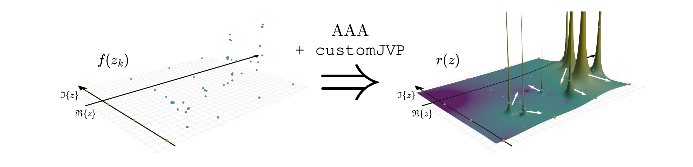

# diffaaable 0.1.0



A JAX differentiable version of the AAA algorithm. The derivatives are implemented as custom Jacobian Vector products in accordance to [^1].
A detailed derivation of the used matrix expressions is provided in the appendix of [^2].
Under the hood `diffaaable` uses the AAA implementation of [`baryrat`](https://github.com/c-f-h/baryrat).
Additionaly the following application specific extensions to the AAA algorithm are included:

- **Adaptive**: Adaptive refinement strategy to minimize the number of function evaluation needed to precisely locate poles within some domain
- **Vectorial** (also referred to as set-valued): AAA algorithm acting on vector valued functions $\mathbf{f}(z)$ as presented in [^3]
- **Lorentz**: Variant that enforces symmetric poles around the imaginary axis.
- **Selective Refinement**: Use a divide and conquer theme to capture many pole simultaneously and accurately, by limiting the number of poles per AAA solve. Suggested in [^4]

## Usage

Just use it as an (almost) drop-in replacement for `baryrat`. Note how the nodes, values and weights of the barycentric approximation are returned instead of a callable function.

```python
from diffaaable import aaa

z_j, f_j, w_j, z_n = aaa(z_k, f_k)
```

## Installation
to install `diffaaable` simply run
`pip install diffaaable`

## Citation
When using this software package for scientific work please cite the associated publication [^2].


[^1]: https://arxiv.org/pdf/2403.19404
[^2]: Multiscat Resonances (to be publlished)
[^3]: https://doi.org/10.1093/imanum/draa098
[^4]: https://doi.org/10.48550/arXiv.2405.19582